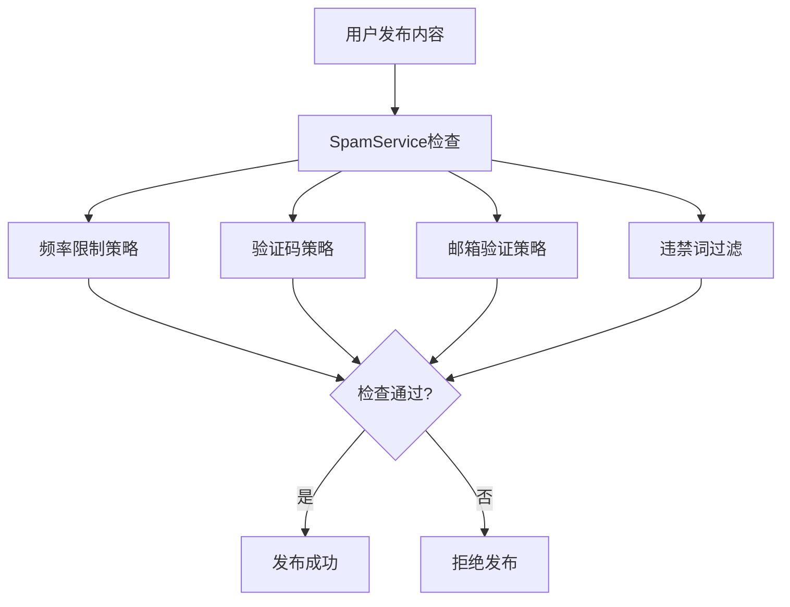

# BBS-GO 后端架构文档

## 1. 项目概述

BBS-GO 是一个基于 Go 语言开发的现代化论坛系统，采用前后端分离架构，后端使用 Iris 框架提供 REST API 服务。

## 2. 整体架构

### 2.1 架构模式
- **分层架构**：采用经典的MVC分层架构
- **前后端分离**：后端提供REST API，前端独立部署
- **缓存策略**：内存缓存 + 数据库持久化

### 2.2 技术栈
- **Web框架**：Iris v12
- **ORM**：GORM
- **数据库**：支持MySQL/PostgreSQL等
- **缓存**：内存缓存
- **搜索引擎**：MeiliSearch（替换了ES）
- **邮件服务**：SMTP
- **文件上传**：本地/云存储

## 3. 目录结构

```
server/
├── cmd/                    # 命令行工具
│   └── test/              # 测试工具
├── internal/              # 内部包，不对外暴露
│   ├── cache/            # 缓存层
│   ├── controllers/      # 控制器层
│   │   ├── admin/       # 管理后台API
│   │   ├── api/         # 前端API
│   │   └── render/      # 数据渲染层
│   ├── install/         # 安装配置
│   ├── middleware/      # 中间件
│   ├── models/          # 数据模型
│   │   ├── constants/   # 常量定义
│   │   └── dto/        # 数据传输对象
│   ├── pkg/            # 内部工具包
│   ├── repositories/   # 数据访问层
│   ├── scheduler/      # 定时任务
│   ├── server/        # 服务器配置
│   ├── services/      # 业务逻辑层
│   │   └── eventhandler/ # 事件处理
│   └── spam/          # 反垃圾
├── locales/           # 国际化文件
├── logs/              # 日志文件
└── migrations/        # 数据库迁移
```

## 4. 核心组件架构

### 4.1 分层架构图


### 4.2 核心模型关系图


## 5. 功能模块详细架构

### 5.1 用户认证系统

#### 5.1.1 认证流程时序图


#### 5.1.2 Token管理机制

- **Token生成**：使用UUID生成32位随机字符串
- **Token存储**：数据库持久化 + 内存缓存
- **Token验证**：支持Cookie、Header（Authorization/X-User-Token）多种方式
- **Token过期**：可配置过期时间，默认30天
- **Token失效**：登出时标记为删除状态

### 5.2 消息通知系统

#### 5.2.1 消息通知架构

**重要发现：该系统采用数据库轮询方式实现消息通知，无WebSocket推送，无消息队列**


#### 5.2.2 消息通知时序图


#### 5.2.3 消息类型和触发机制

```go
// 消息类型定义
const (
    TypeTopicComment   Type = 0 // 收到话题评论
    TypeCommentReply   Type = 1 // 收到他人回复  
    TypeTopicLike      Type = 2 // 收到点赞
    TypeTopicFavorite  Type = 3 // 话题被收藏
    TypeTopicRecommend Type = 4 // 话题被设为推荐
    TypeTopicDelete    Type = 5 // 话题被删除
    TypeArticleComment Type = 6 // 收到文章评论
)
```

**通知机制特点：**
- ✅ **数据库存储**：所有消息持久化存储在数据库
- ✅ **邮件通知**：支持邮件推送（除话题删除外）
- ❌ **实时推送**：无WebSocket实时推送
- ❌ **消息队列**：无异步消息队列处理
- ✅ **前端轮询**：前端通过定时请求获取未读消息

### 5.3 内容管理系统

#### 5.3.1 话题发布流程


#### 5.3.2 评论系统流程


### 5.4 搜索系统


## 6. 数据库设计

### 6.1 核心表结构

#### 用户表 (t_user)
- id: 主键
- username: 用户名（唯一）
- email: 邮箱（唯一）
- password: 加密密码
- nickname: 昵称
- avatar: 头像
- status: 状态
- score: 积分
- create_time: 创建时间

#### 话题表 (t_topic)
- id: 主键
- user_id: 发布用户ID
- node_id: 节点ID
- title: 标题
- content: 内容
- content_type: 内容类型
- status: 状态
- view_count: 浏览数
- comment_count: 评论数
- create_time: 创建时间

#### 消息表 (t_message)
- id: 主键
- from_id: 发送者ID
- user_id: 接收者ID
- title: 标题
- content: 内容
- type: 消息类型
- status: 读取状态
- create_time: 创建时间

## 7. 缓存策略

### 7.1 缓存架构


### 7.2 缓存管理
- **用户缓存**：缓存用户基本信息，更新时失效
- **Token缓存**：缓存用户Token，提高认证性能
- **配置缓存**：缓存系统配置，减少数据库查询
- **内容缓存**：缓存热门内容，提高访问速度

## 8. 安全机制

### 8.1 认证授权
- **Token认证**：基于UUID的Token机制
- **权限控制**：基于角色的权限管理
- **管理员认证**：独立的管理员认证中间件

### 8.2 安全防护
- **验证码**：登录注册需要验证码
- **反垃圾**：多种反垃圾策略
- **输入验证**：严格的参数验证
- **SQL注入防护**：ORM框架防护

### 8.3 反垃圾系统



## 9. 性能优化

### 9.1 数据库优化
- **索引优化**：合理设计数据库索引
- **查询优化**：使用条件构建器优化查询
- **分页查询**：游标分页提高性能

### 9.2 缓存优化
- **多级缓存**：内存缓存 + 数据库缓存
- **缓存预热**：系统启动时预热热点数据
- **缓存更新**：写入时失效策略

### 9.3 其他优化
- **静态资源**：支持静态资源压缩和缓存
- **数据库连接池**：GORM连接池管理
- **异步处理**：邮件发送等异步处理

## 10. 部署架构

### 10.1 推荐部署架构


### 10.2 环境配置
- **开发环境**：单机部署，SQLite数据库
- **测试环境**：独立数据库，完整功能测试
- **生产环境**：集群部署，读写分离，缓存集群

## 11. 监控和日志

### 11.1 日志系统
- **访问日志**：记录所有API请求
- **错误日志**：记录系统错误和异常
- **业务日志**：记录重要业务操作
- **操作日志**：管理员操作审计

### 11.2 监控指标
- **性能监控**：响应时间、吞吐量
- **错误监控**：错误率、异常统计
- **业务监控**：用户活跃度、内容统计
- **系统监控**：CPU、内存、磁盘使用率

## 12. 总结

BBS-GO后端采用现代化的Go技术栈，具有以下特点：

### 优点：
- **架构清晰**：分层架构，职责明确
- **性能优良**：Go语言高性能，合理的缓存策略
- **功能完整**：涵盖论坛所需的核心功能
- **安全可靠**：多重安全防护机制
- **易于维护**：代码结构清晰，注释完善

### 可优化点：
- **消息通知**：可考虑引入WebSocket实现实时推送
- **消息队列**：可引入消息队列处理异步任务
- **微服务化**：可考虑将大模块拆分为微服务
- **容器化**：可使用Docker容器化部署

### 技术特色：
1. **无实时推送**：消息通知采用前端轮询 + 邮件通知方式
2. **简化架构**：避免了复杂的消息队列，降低运维成本
3. **缓存优先**：大量使用内存缓存提高性能
4. **安全为先**：多层安全防护，防范常见安全威胁

该架构适合中小型论坛社区，在保证功能完整性的同时，保持了较低的技术复杂度和运维成本。