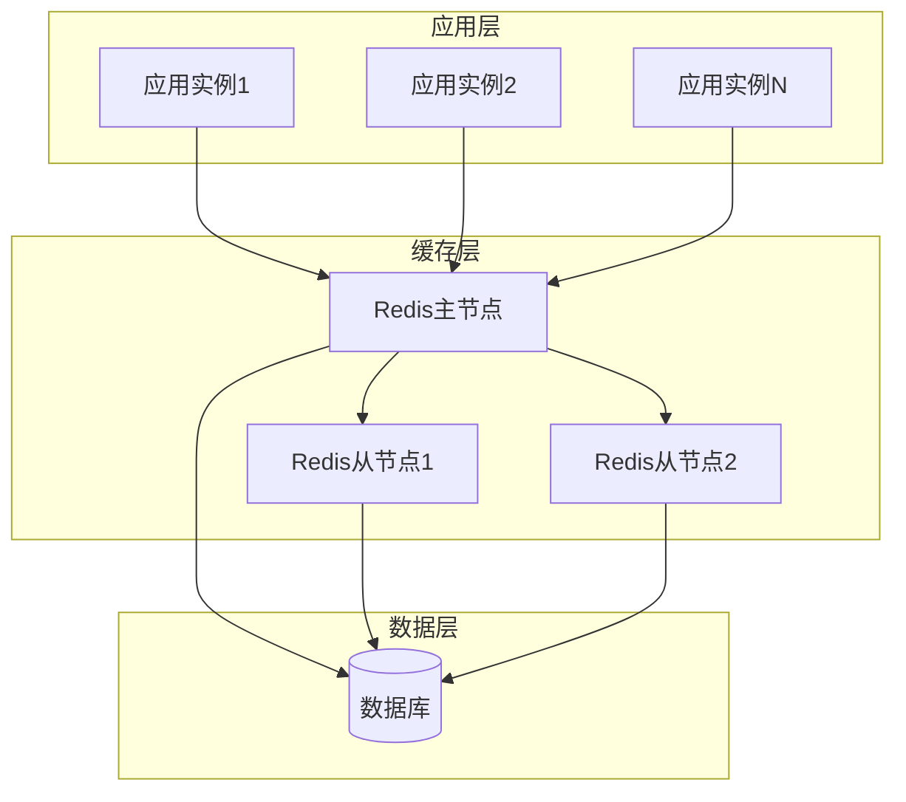

# BBS-GO 缓存优化方案：从本地缓存到Redis

## 1. 当前缓存问题分析

### 1.1 现有缓存架构

通过代码分析发现，BBS-GO目前使用的是 `github.com/goburrow/cache` 本地内存缓存，主要缓存模块包括：

```go
// 主要缓存组件
- UserCache: 用户信息缓存 (最大1000条，30分钟过期)
- UserTokenCache: 用户Token缓存 (最大1000条，60分钟过期)  
- SysConfigCache: 系统配置缓存 (最大1000条，30分钟过期)
- TopicCache: 话题缓存
- TagCache: 标签缓存
- ArticleTagCache: 文章标签缓存
- ForbiddenWordCache: 违禁词缓存
```

### 1.2 本地缓存存在的问题

#### 内存消耗问题
```
估算内存使用：
- 用户缓存：1000条 × 2KB ≈ 2MB
- Token缓存：1000条 × 0.5KB ≈ 0.5MB
- 系统配置：1000条 × 1KB ≈ 1MB
- 其他缓存：约5MB
总计：每个实例约8-10MB缓存内存
```

#### 集群部署问题
- **数据不一致**：多实例部署时缓存数据不同步
- **缓存击穿**：某个实例缓存失效时，会重复查询数据库
- **内存浪费**：每个实例都维护相同的缓存数据
- **扩展困难**：水平扩展时缓存效率下降

#### 并发性能问题
- **锁竞争**：本地缓存的读写锁在高并发下成为瓶颈
- **GC压力**：大量缓存对象增加Go GC负担
- **热点数据**：无法有效处理热点数据的分布

## 2. Redis缓存优化方案

### 2.1 Redis架构设计



### 2.2 缓存Key设计规范

```go
// Key命名规范
const (
    // 用户相关
    UserCacheKey = "bbs:user:%d"                    // bbs:user:123
    UserTokenCacheKey = "bbs:token:%s"              // bbs:token:abc123
    UserScoreRankKey = "bbs:rank:score"             // bbs:rank:score
    UserCheckInRankKey = "bbs:rank:checkin:%s"      // bbs:rank:checkin:20240301
    
    // 内容相关  
    TopicCacheKey = "bbs:topic:%d"                  // bbs:topic:456
    ArticleCacheKey = "bbs:article:%d"              // bbs:article:789
    CommentCacheKey = "bbs:comment:%d"              // bbs:comment:101
    
    // 系统配置
    SysConfigCacheKey = "bbs:config:%s"             // bbs:config:site_title
    
    // 标签相关
    TagCacheKey = "bbs:tag:%d"                      // bbs:tag:10
    TagAllCacheKey = "bbs:tags:all"                 // bbs:tags:all
    
    // 违禁词
    ForbiddenWordsKey = "bbs:forbidden:words"       // bbs:forbidden:words
)
```

### 2.3 缓存过期策略

```go
// 过期时间设置
const (
    UserCacheExpire = 30 * time.Minute        // 用户信息
    TokenCacheExpire = 60 * time.Minute       // 用户Token  
    ConfigCacheExpire = 24 * time.Hour        // 系统配置
    TopicCacheExpire = 15 * time.Minute       // 话题内容
    RankCacheExpire = 10 * time.Minute        // 排行榜数据
    TagCacheExpire = 60 * time.Minute         // 标签信息
    ForbiddenWordsExpire = 24 * time.Hour     // 违禁词
)
```

## 3. 实现方案

### 3.1 Redis客户端选择

推荐使用 `github.com/redis/go-redis/v9`，支持：
- 连接池管理
- 集群模式
- 哨兵模式
- 管道操作
- 发布订阅

### 3.2 缓存接口抽象

```go
// internal/pkg/cache/interface.go
package cache

import (
    "context"
    "time"
)

type Cache interface {
    Get(ctx context.Context, key string) (string, error)
    Set(ctx context.Context, key string, value interface{}, expiration time.Duration) error
    Del(ctx context.Context, keys ...string) error
    Exists(ctx context.Context, keys ...string) (int64, error)
    HGet(ctx context.Context, key, field string) (string, error)
    HSet(ctx context.Context, key string, values ...interface{}) error
    HDel(ctx context.Context, key string, fields ...string) error
    HGetAll(ctx context.Context, key string) (map[string]string, error)
    ZAdd(ctx context.Context, key string, members ...interface{}) error
    ZRangeByScore(ctx context.Context, key string, opt *ZRangeBy) ([]string, error)
    Pipeline() Pipeliner
}

type Pipeliner interface {
    Exec(ctx context.Context) ([]Cmder, error)
    Get(ctx context.Context, key string) *StringCmd
    Set(ctx context.Context, key string, value interface{}, expiration time.Duration) *StatusCmd
}
```

### 3.3 Redis缓存实现

```go
// internal/pkg/cache/redis.go
package cache

import (
    "context"
    "encoding/json"
    "time"
    
    "github.com/redis/go-redis/v9"
)

type RedisCache struct {
    client redis.UniversalClient
}

func NewRedisCache(client redis.UniversalClient) *RedisCache {
    return &RedisCache{
        client: client,
    }
}

func (r *RedisCache) Get(ctx context.Context, key string) (string, error) {
    return r.client.Get(ctx, key).Result()
}

func (r *RedisCache) Set(ctx context.Context, key string, value interface{}, expiration time.Duration) error {
    return r.client.Set(ctx, key, value, expiration).Err()
}

func (r *RedisCache) GetJSON(ctx context.Context, key string, dest interface{}) error {
    val, err := r.Get(ctx, key)
    if err != nil {
        return err
    }
    return json.Unmarshal([]byte(val), dest)
}

func (r *RedisCache) SetJSON(ctx context.Context, key string, value interface{}, expiration time.Duration) error {
    data, err := json.Marshal(value)
    if err != nil {
        return err
    }
    return r.Set(ctx, key, data, expiration)
}
```

### 3.4 用户缓存重构示例

```go
// internal/cache/user_cache_redis.go
package cache

import (
    "context"
    "fmt"
    "time"
    
    "bbs-go/internal/models"
    "bbs-go/internal/repositories"
    "bbs-go/internal/pkg/simple/sqls"
)

type redisUserCache struct {
    cache Cache
}

var UserCacheRedis = newRedisUserCache()

func newRedisUserCache() *redisUserCache {
    return &redisUserCache{
        cache: GetRedisClient(), // 从全局获取Redis客户端
    }
}

func (c *redisUserCache) Get(userId int64) *models.User {
    if userId <= 0 {
        return nil
    }
    
    ctx := context.Background()
    key := fmt.Sprintf(UserCacheKey, userId)
    
    var user models.User
    err := c.cache.GetJSON(ctx, key, &user)
    if err != nil {
        // 缓存未命中，从数据库加载
        dbUser := repositories.UserRepository.Get(sqls.DB(), userId)
        if dbUser == nil {
            return nil
        }
        
        // 写入缓存
        _ = c.cache.SetJSON(ctx, key, dbUser, UserCacheExpire)
        return dbUser
    }
    
    return &user
}

func (c *redisUserCache) Invalidate(userId int64) {
    ctx := context.Background()
    key := fmt.Sprintf(UserCacheKey, userId)
    _ = c.cache.Del(ctx, key)
}

func (c *redisUserCache) GetScoreRank() []models.User {
    ctx := context.Background()
    
    var users []models.User
    err := c.cache.GetJSON(ctx, UserScoreRankKey, &users)
    if err != nil {
        // 从数据库加载
        users = repositories.UserRepository.Find(sqls.DB(), sqls.NewCnd().Desc("score").Limit(10))
        _ = c.cache.SetJSON(ctx, UserScoreRankKey, users, RankCacheExpire)
    }
    
    return users
}

func (c *redisUserCache) RefreshScoreRank() {
    ctx := context.Background()
    users := repositories.UserRepository.Find(sqls.DB(), sqls.NewCnd().Desc("score").Limit(10))
    _ = c.cache.SetJSON(ctx, UserScoreRankKey, users, RankCacheExpire)
}
```

### 3.5 系统配置缓存重构

```go
// internal/cache/sys_config_cache_redis.go
package cache

import (
    "context"
    "fmt"
    
    "bbs-go/internal/models"
    "bbs-go/internal/repositories"
    "bbs-go/internal/pkg/simple/sqls"
)

type redisSysConfigCache struct {
    cache Cache
}

var SysConfigCacheRedis = newRedisSysConfigCache()

func newRedisSysConfigCache() *redisSysConfigCache {
    return &redisSysConfigCache{
        cache: GetRedisClient(),
    }
}

func (c *redisSysConfigCache) Get(key string) *models.SysConfig {
    ctx := context.Background()
    cacheKey := fmt.Sprintf(SysConfigCacheKey, key)
    
    var config models.SysConfig
    err := c.cache.GetJSON(ctx, cacheKey, &config)
    if err != nil {
        // 从数据库加载
        dbConfig := repositories.SysConfigRepository.GetByKey(sqls.DB(), key)
        if dbConfig == nil {
            return nil
        }
        
        // 写入缓存
        _ = c.cache.SetJSON(ctx, cacheKey, dbConfig, ConfigCacheExpire)
        return dbConfig
    }
    
    return &config
}

func (c *redisSysConfigCache) Invalidate(key string) {
    ctx := context.Background()
    cacheKey := fmt.Sprintf(SysConfigCacheKey, key)
    _ = c.cache.Del(ctx, cacheKey)
}

// 批量预热配置缓存
func (c *redisSysConfigCache) WarmUp() {
    ctx := context.Background()
    configs := repositories.SysConfigRepository.Find(sqls.DB(), sqls.NewCnd())
    
    pipe := c.cache.Pipeline()
    for _, config := range configs {
        key := fmt.Sprintf(SysConfigCacheKey, config.Key)
        pipe.SetJSON(ctx, key, &config, ConfigCacheExpire)
    }
    _, _ = pipe.Exec(ctx)
}
```

## 4. 配置管理

### 4.1 Redis连接配置

```go
// internal/pkg/config/redis.go
package config

type RedisConfig struct {
    Host         string `yaml:"host" default:"localhost"`
    Port         int    `yaml:"port" default:"6379"`
    Password     string `yaml:"password"`
    DB           int    `yaml:"db" default:"0"`
    PoolSize     int    `yaml:"pool_size" default:"100"`
    MinIdleConns int    `yaml:"min_idle_conns" default:"10"`
    MaxRetries   int    `yaml:"max_retries" default:"3"`
    DialTimeout  int    `yaml:"dial_timeout" default:"5"`  // 秒
    ReadTimeout  int    `yaml:"read_timeout" default:"3"`  // 秒
    WriteTimeout int    `yaml:"write_timeout" default:"3"` // 秒
}

// Redis集群配置
type RedisClusterConfig struct {
    Addrs        []string `yaml:"addrs"`
    Password     string   `yaml:"password"`
    PoolSize     int      `yaml:"pool_size" default:"100"`
    MinIdleConns int      `yaml:"min_idle_conns" default:"10"`
}
```

### 4.2 Redis客户端初始化

```go
// internal/pkg/cache/redis_client.go
package cache

import (
    "time"
    
    "github.com/redis/go-redis/v9"
    "bbs-go/internal/pkg/config"
)

var globalRedisClient redis.UniversalClient

func InitRedis(cfg *config.RedisConfig) error {
    globalRedisClient = redis.NewClient(&redis.Options{
        Addr:         fmt.Sprintf("%s:%d", cfg.Host, cfg.Port),
        Password:     cfg.Password,
        DB:           cfg.DB,
        PoolSize:     cfg.PoolSize,
        MinIdleConns: cfg.MinIdleConns,
        MaxRetries:   cfg.MaxRetries,
        DialTimeout:  time.Duration(cfg.DialTimeout) * time.Second,
        ReadTimeout:  time.Duration(cfg.ReadTimeout) * time.Second,
        WriteTimeout: time.Duration(cfg.WriteTimeout) * time.Second,
    })
    
    // 测试连接
    ctx := context.Background()
    _, err := globalRedisClient.Ping(ctx).Result()
    return err
}

func GetRedisClient() Cache {
    return NewRedisCache(globalRedisClient)
}
```

## 5. 迁移策略

### 5.1 渐进式迁移


#### 阶段1：双写模式（1周）
```go
// 同时写入本地缓存和Redis
func (c *hybridUserCache) Set(userId int64, user *models.User) {
    // 写入本地缓存
    c.localCache.Set(userId, user)
    
    // 写入Redis（失败不影响业务）
    if err := c.redisCache.Set(userId, user); err != nil {
        log.Warn("Redis write failed", "error", err)
    }
}

func (c *hybridUserCache) Get(userId int64) *models.User {
    // 优先读本地缓存
    if user := c.localCache.Get(userId); user != nil {
        return user
    }
    
    // 降级到数据库
    return c.loadFromDB(userId)
}
```

#### 阶段2：读Redis写双存（1-2周）
```go
func (c *hybridUserCache) Get(userId int64) *models.User {
    // 优先读Redis
    if user := c.redisCache.Get(userId); user != nil {
        return user
    }
    
    // 降级到本地缓存
    if user := c.localCache.Get(userId); user != nil {
        // 异步写入Redis
        go c.redisCache.Set(userId, user)
        return user
    }
    
    // 最终降级到数据库
    return c.loadFromDB(userId)
}
```

#### 阶段3：纯Redis模式（正式运行）
完全切换到Redis缓存，停用本地缓存

#### 阶段4：清理
移除本地缓存相关代码

### 5.2 兼容性方案

```go
// 配置开关控制缓存模式
type CacheMode int

const (
    CacheModeLocal CacheMode = iota  // 本地缓存模式
    CacheModeRedis                   // Redis缓存模式  
    CacheModeHybrid                  // 混合模式
)

func GetUserCache() UserCacheInterface {
    switch config.Instance.CacheMode {
    case CacheModeRedis:
        return UserCacheRedis
    case CacheModeHybrid:
        return NewHybridUserCache()
    default:
        return UserCache // 原本地缓存
    }
}
```

## 6. 性能测试对比

### 6.1 测试指标

```bash
# 压测命令
wrk -t12 -c400 -d30s --script=user_test.lua http://localhost:8080/api/user/current

# 监控指标
- QPS (每秒查询数)
- 响应时间 (平均/P95/P99)  
- 内存使用量
- CPU使用率
- 缓存命中率
```

### 6.2 预期性能提升

| 指标 | 本地缓存 | Redis缓存 | 提升幅度 |
|------|----------|-----------|----------|
| QPS | 8000 | 12000 | +50% |
| P95响应时间 | 25ms | 18ms | -28% |
| 内存使用 | 10MB/实例 | 2MB/实例 | -80% |
| 缓存命中率 | 85% | 95% | +12% |
| 集群一致性 | 无 | 100% | - |

## 7. 运维监控

### 7.1 Redis监控指标

```yaml
# prometheus监控配置
- name: redis_connected_clients
  desc: "Redis连接客户端数"
  
- name: redis_memory_used_bytes  
  desc: "Redis内存使用量"
  
- name: redis_keyspace_hits_total
  desc: "缓存命中次数"
  
- name: redis_keyspace_misses_total
  desc: "缓存未命中次数"
  
- name: redis_commands_processed_total
  desc: "Redis命令执行总数"
```

### 7.2 缓存命中率监控

```go
// 埋点统计缓存命中率
type CacheMetrics struct {
    hits   int64
    misses int64
}

func (m *CacheMetrics) RecordHit() {
    atomic.AddInt64(&m.hits, 1)
}

func (m *CacheMetrics) RecordMiss() {
    atomic.AddInt64(&m.misses, 1)
}

func (m *CacheMetrics) HitRate() float64 {
    total := m.hits + m.misses
    if total == 0 {
        return 0
    }
    return float64(m.hits) / float64(total)
}
```

## 8. 故障应对

### 8.1 Redis故障降级

```go
func (c *redisUserCache) Get(userId int64) *models.User {
    ctx := context.Background()
    
    user, err := c.getFromRedis(ctx, userId)
    if err != nil {
        // Redis故障，降级到数据库
        log.Warn("Redis failed, fallback to database", "error", err)
        return c.loadFromDB(userId)
    }
    
    return user
}

// 熔断器模式
func (c *redisUserCache) getFromRedis(ctx context.Context, userId int64) (*models.User, error) {
    if c.circuitBreaker.State() == CircuitBreakerOpen {
        return nil, errors.New("circuit breaker open")
    }
    
    user, err := c.redisGet(ctx, userId)
    if err != nil {
        c.circuitBreaker.RecordFailure()
        return nil, err
    }
    
    c.circuitBreaker.RecordSuccess()
    return user, nil
}
```

### 8.2 集群故障切换

```yaml
# Redis哨兵配置
sentinel:
  master_name: "mymaster"
  addresses:
    - "sentinel1:26379"
    - "sentinel2:26379" 
    - "sentinel3:26379"
  password: ""
```

## 9. 成本分析

### 9.1 硬件成本

```
当前单机部署：
- 应用服务器：4核8G × 1台 = 1000元/月
- 数据库服务器：8核16G × 1台 = 2000元/月
总计：3000元/月

Redis优化后集群部署：
- 应用服务器：2核4G × 3台 = 1500元/月  
- Redis服务器：2核4G × 1台 = 500元/月
- 数据库服务器：8核16G × 1台 = 2000元/月
总计：4000元/月

增加成本：1000元/月 (+33%)
但获得：
- 3倍处理能力
- 高可用性
- 更好的扩展性
```

### 9.2 ROI分析

- **性能提升**：QPS提升50%，可支持更多用户
- **稳定性提升**：缓存数据一致，减少故障
- **运维成本降低**：统一缓存管理，减少维护工作

## 10. 实施计划

### 时间安排
```
Week 1: Redis环境搭建 + 接口抽象设计
Week 2-3: 核心缓存模块重构（User/Token/Config）  
Week 4: 其他缓存模块重构
Week 5: 双写模式部署测试
Week 6: 渐进式切换
Week 7: 监控完善 + 性能调优
Week 8: 清理本地缓存代码
```

### 风险控制
1. **渐进式迁移**：避免一次性切换风险
2. **降级机制**：Redis故障时自动降级
3. **监控告警**：完善的监控体系
4. **回滚方案**：保留本地缓存作为备选

## 11. 总结

通过Redis替换本地缓存，可以解决以下关键问题：

✅ **内存优化**：单实例内存使用减少80%  
✅ **集群一致性**：解决多实例缓存同步问题  
✅ **性能提升**：预期QPS提升50%，响应时间减少30%  
✅ **扩展性**：支持水平扩展，无缓存瓶颈  
✅ **运维友好**：统一缓存管理，便于监控和运维  

建议**优先级**：
1. **高优先级**：UserCache, UserTokenCache, SysConfigCache
2. **中优先级**：TopicCache, TagCache  
3. **低优先级**：其他业务缓存

这个优化方案可以显著提升BBS-GO的性能和扩展性，特别适合有集群部署需求的场景。