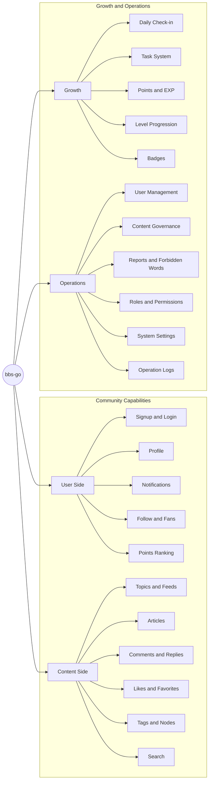

[English](README.en-US.md) | [中文](README.md)

> Thanks for your support. If you like this open-source project, please give it a star. Your support keeps us moving forward.

## Official Links

- Website: [https://bbs-go.com](https://bbs-go.com)
- Community: [https://bbs.bbs-go.com](https://bbs.bbs-go.com)
- GitHub: [https://github.com/mlogclub/bbs-go](https://github.com/mlogclub/bbs-go)
- Gitee: [https://gitee.com/mlogclub/bbs-go](https://gitee.com/mlogclub/bbs-go)

## Demo

- Frontend: https://demo.bbs-go.com
- Admin: https://demo.bbs-go.com/admin
- Account: `admin / 123456`

## Why Choose bbs-go

- **Ready out of the box**: Core community capabilities including signup/login, posting, commenting, likes, favorites, follows, and notifications.
- **Growth loop built-in**: Tasks, points, levels, and badges to improve user activity and retention.
- **Operations friendly**: Content governance, user governance, permission governance, and system settings for long-term operations.
- **Bilingual support**: Built-in `en-US` and `zh-CN` for multilingual community scenarios.

## Feature Map

## Core Features

### User Side

- Account registration and login (multiple login methods supported)
- User profile management and personal homepage
- Follow/fan relationship management
- In-site notifications and interaction reminders
- Point records and leaderboards

### Content Side

- Publish and edit topics, feeds, and articles
- Complete interaction loop with comments, replies, likes, and favorites
- Tags and nodes for better content organization and discovery
- Interactive features like voting and hidden content
- In-site search for faster content retrieval

### Growth Side

- Daily check-in for ongoing activity incentives
- Task system (new user, daily, achievement)
- Points and EXP reward mechanisms
- Level progression configuration
- Badge and honor system

### Operations Side

- Unified governance for users, topics, comments, and articles
- Report handling and forbidden-word management
- Role, menu, and API permission management
- System parameter and site configuration management
- Operation logs and audit trails

## Typical Use Cases

- Developer and technical communities
- Hobby and interest-based communities
- Product user communities
- Internal enterprise knowledge communities
- Content membership communities

## Contact

QQ Group:

WeChat:

## Commercial Services

Paid services help sustain long-term development while the project remains open source.

| Service | Price | Description |
| ------- | ----- | ----------- |
| Commercial License | CNY 1628 | Commercial usage license for bbs-go |
| Feature Customization | Negotiable | Custom feature development based on your needs |

## What Is bbs-go

`bbs-go` is an open-source community system that helps you quickly build an operable and growth-oriented content community.

In one sentence: **Publish easily, engage deeply, govern effectively, and grow continuously.**

## Contributors

