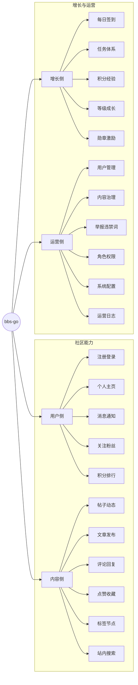
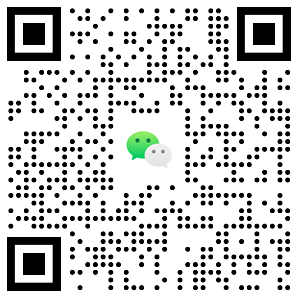

[中文](README.md) | [English](README.en-US.md)

> 感谢您的支持与鼓励！如果您喜欢这个开源项目，不妨给它点个⭐️⭐️⭐️，您的星星是我们前进的动力 🙏🙏🙏

## 官网

- 官网：[https://bbs-go.com](https://bbs-go.com)
- 交流社区：[https://bbs.bbs-go.com](https://bbs.bbs-go.com)
- Github：[https://github.com/mlogclub/bbs-go](https://github.com/mlogclub/bbs-go)
- Gitee：[https://gitee.com/mlogclub/bbs-go](https://gitee.com/mlogclub/bbs-go)

## 演示

- 前台: https://demo.bbs-go.com
- 后台: https://demo.bbs-go.com/admin
- 账号密码: admin/123456

## 为什么选择 bbs-go

- **开箱可用**：注册登录、发帖评论、点赞收藏、关注消息等核心社区能力可直接使用。
- **增长闭环**：内置任务、积分、等级、勋章，支持用户活跃和长期留存。
- **运营友好**：提供内容治理、用户治理、权限治理与系统配置能力，方便持续运营。
- **双语支持**：内置 `en-US` / `zh-CN`，适合面向不同语言用户的社区场景。

## 功能地图

## 核心功能

### 用户侧

- 账号注册与登录（支持多种登录方式）
- 用户资料维护与个人主页展示
- 关注/粉丝关系管理
- 站内消息与互动提醒
- 积分记录与排行榜

### 内容侧

- 支持帖子、动态、文章发布与编辑
- 评论、回复、点赞、收藏等完整互动链路
- 标签与节点管理，便于内容组织和发现
- 支持投票、隐藏内容等互动玩法
- 站内搜索能力，提升内容检索效率

### 增长侧

- 每日签到，持续活跃激励
- 任务体系（新手、每日、成就）
- 积分与经验奖励机制
- 等级成长配置
- 勋章与荣誉体系

### 运营侧

- 用户、帖子、评论、文章等统一治理
- 举报处理与违禁词管理
- 角色、菜单、接口权限分配
- 系统参数与站点配置管理
- 运营日志与行为留痕

## 适用场景

- 技术交流社区
- 兴趣爱好社群
- 产品用户社区
- 企业内部知识社区
- 内容型会员社区

## 联系我

QQ群：

微信：

## 付费服务

付费是为了项目能够更好的生存下去，请谅解。项目将一如既往的开源下去~

| 服务     | 价格   | 服务内容                                         |
| -------- | ------ | ------------------------------------------------ |
| 商用授权 | ￥1628 | 提供 bbs-go 商业使用授权                         |
| 功能定制 | 面议   | 接受各种功能定制，只有你想不到的没有我们做不到的 |

## bbs-go 是什么

`bbs-go` 是一个开源社区系统，帮助你快速搭建可运营、可增长的内容社区。

一句话概括：**发得出来、聊得起来、管得住、长得快**。

## Contributors

