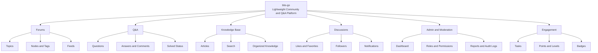

[English](README.md) | [中文](README.zh-CN.md)

# bbs-go

`bbs-go` is a lightweight community and Q&A platform for forums, knowledge bases, and discussions.

It includes forums, Q&A topics, articles, comments, notifications, moderation, roles, an admin dashboard, and optional growth mechanics such as tasks, points, levels, and badges.

## Official Links

- Website: [https://bbs-go.com](https://bbs-go.com)
- Community: [https://bbs.bbs-go.com](https://bbs.bbs-go.com)
- GitHub: [https://github.com/mlogclub/bbs-go](https://github.com/mlogclub/bbs-go)
- Docker Hub: [https://hub.docker.com/r/mlogclub/bbs-go](https://hub.docker.com/r/mlogclub/bbs-go)
- Gitee: [https://gitee.com/mlogclub/bbs-go](https://gitee.com/mlogclub/bbs-go)

## Demo

- Frontend: <https://bbs.bbs-go.com>
- Admin dashboard: <https://bbs.bbs-go.com/dashboard>
- Admin demo access: send an email to <mlog1@qq.com>

## Quick Start with Docker Compose

bbs-go provides an official Docker image and Docker Compose deployment with built-in MySQL support.

```bash
curl -fsSL https://raw.githubusercontent.com/mlogclub/bbs-go/master/docker-compose.yml -o docker-compose.yml
docker compose up -d
```

Then open:

- Site: <http://localhost:3000>
- Admin dashboard: <http://localhost:3000/dashboard>
- Install wizard: <http://localhost:3000/install>

For production deployment options, environment variables, upgrades, and troubleshooting, see the Docker Hub page:

<https://hub.docker.com/r/mlogclub/bbs-go>

## Why Choose bbs-go

- **Launch faster**: Ship a forum, Q&A community, or knowledge base without building auth, posting, comments, notifications, moderation, and admin tools from scratch.
- **Deploy in minutes**: Use the official Docker image and Docker Compose setup for a simple self-hosted deployment.
- **Lightweight but complete**: Cover discussions, Q&A, articles, profiles, search, and admin workflows without a heavy enterprise stack.
- **Community engagement included**: Tasks, points, EXP, levels, rankings, and badges help communities create repeat engagement loops when needed.
- **Operations ready**: Manage users, content, reports, keyword filters, roles, permissions, site settings, and audit logs from the dashboard.
- **International by default**: Built-in `en-US` and `zh-CN` support for multilingual community scenarios.

## Typical Use Cases

- **Forums**: public or private spaces for threaded community discussions.
- **Q&A communities**: question-style topics, answers, comments, and solved/unsolved workflows.
- **Knowledge bases**: articles, searchable discussions, tags, and organized knowledge sharing.
- **Product and developer communities**: support conversations, announcements, feedback, and user engagement.
- **Internal team communities**: searchable discussions, role-based access, and team knowledge sharing.

## Feature Map


```mermaid
flowchart TB
  A["bbs-go<br/>Lightweight Community and Q&A Platform"]

  A --> B["Forums"]
  A --> C["Q&A"]
  A --> D["Knowledge Base"]
  A --> E["Discussions"]

  B --> B1["Topics"]
  B --> B2["Nodes and Tags"]
  B --> B3["Feeds"]

  C --> C1["Questions"]
  C --> C2["Answers and Comments"]
  C --> C3["Solved Status"]

  D --> D1["Articles"]
  D --> D2["Search"]
  D --> D3["Organized Knowledge"]

  E --> E1["Likes and Favorites"]
  E --> E2["Followers"]
  E --> E3["Notifications"]

  A --> F["Admin and Moderation"]
  A --> G["Engagement"]

  F --> F1["Dashboard"]
  F --> F2["Roles and Permissions"]
  F --> F3["Reports and Audit Logs"]

  G --> G1["Tasks"]
  G --> G2["Points and Levels"]
  G --> G3["Badges"]
```

## Core Features

### Member Experience

- Account registration and login with multiple login methods
- User profiles and personal homepages
- Follow and follower relationships
- In-app notifications and interaction reminders
- Point records and leaderboards

### Content and Engagement

- Publish and edit topics, feeds, and articles
- Comments, replies, likes, and favorites
- Tags and nodes for content organization and discovery
- Voting and hidden content
- Built-in search

### Growth Mechanics

- Daily check-in incentives
- Configurable task system for new-user, daily, and achievement rewards
- Points and EXP reward mechanisms
- Level progression configuration
- Badge and honor system

### Operations and Governance

- Unified management for users, topics, comments, and articles
- Report handling and keyword filters
- Role, menu, and API permission management
- Site configuration and system settings
- Operation logs and audit trails

## Screenshots


## Internationalization

bbs-go includes English and Simplified Chinese language support:

- `en-US`
- `zh-CN`

The admin dashboard and server-side messages are designed to support multilingual community operations.

## License

bbs-go is open source under the [GPLv3 License](../LICENSE).

If you need a commercial license, proprietary redistribution rights, or custom development support, see the commercial support section below.

## Commercial Support

Paid services help sustain long-term development while the project remains open source.

| Service | Price | Description |
| ------- | ----- | ----------- |
| Commercial License | Contact us | Commercial usage license for bbs-go |
| Feature Customization | Custom quote | Custom feature development based on your needs |

For business inquiries, contact <mlog1@qq.com>.

## Community and Contact

- Discord: <https://discord.gg/TnzcSqKZyn>
- Email: <mlog1@qq.com>
- GitHub Issues: <https://github.com/mlogclub/bbs-go/issues>

### QQ Group


### WeChat


## Contributors

<a href="https://github.com/mlogclub/bbs-go/graphs/contributors"></a>
