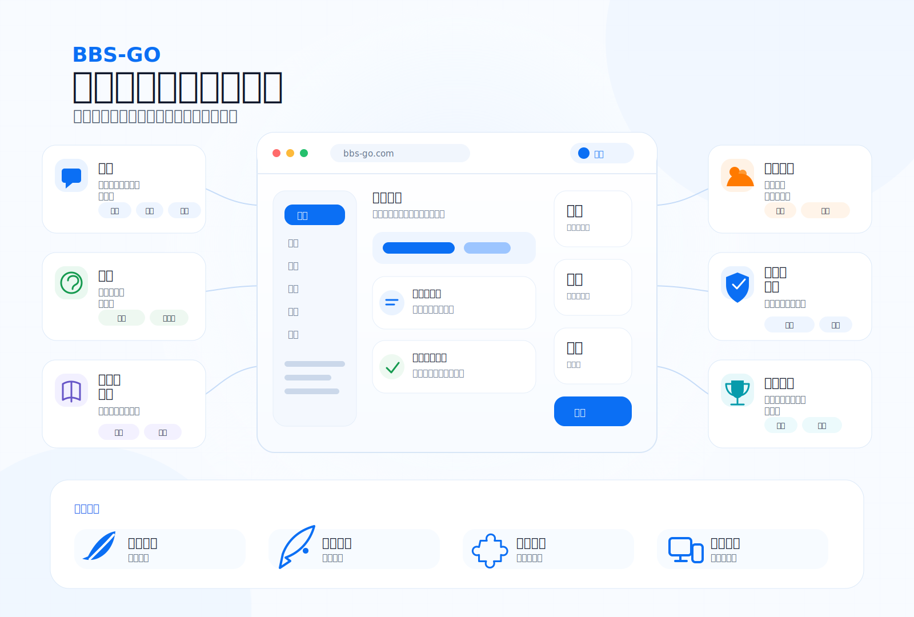

[中文](README.md) | [English](README.en-US.md)


> 感谢您的支持与鼓励！如果您喜欢这个开源项目，不妨给它点个⭐️⭐️⭐️，您的星星是我们前进的动力 🙏🙏🙏

`bbs-go` 是一个轻量级社区和问答平台，适合搭建论坛、知识库和讨论社区。

## 官网

- 官网：[https://bbs-go.com](https://bbs-go.com)
- 交流社区：[https://bbs.bbs-go.com](https://bbs.bbs-go.com)
- Github：[https://github.com/mlogclub/bbs-go](https://github.com/mlogclub/bbs-go)
- Gitee：[https://gitee.com/mlogclub/bbs-go](https://gitee.com/mlogclub/bbs-go)

## 演示

- 前台: https://bbs.bbs-go.com
- 后台: https://bbs.bbs-go.com/dashboard
- 后台账号密码: 联系我们获取，联系方式：<https://bbs-go.com/docs/contact>

## Docker Compose 快速开始

bbs-go 提供官方 Docker 镜像，并提供内置 MySQL 或 PostgreSQL 的 Docker Compose 部署方式。

MySQL：

```bash
curl -fsSL https://raw.githubusercontent.com/mlogclub/bbs-go/master/docker-compose.yml -o docker-compose.yml
docker compose up -d
```

PostgreSQL：

```bash
curl -fsSL https://raw.githubusercontent.com/mlogclub/bbs-go/master/docker-compose.postgresql.yml -o docker-compose.yml
docker compose up -d
```

启动后访问：

- 前台：<http://localhost:3000>
- 后台：<http://localhost:3000/dashboard>
- 安装向导：<http://localhost:3000/install>

## 为什么选择 bbs-go

- **开箱可用**：论坛、问答、文章、评论、点赞收藏、关注消息等核心社区能力可直接使用。
- **轻量完整**：适合搭建论坛、知识库、问答社区和讨论社区，不需要引入沉重的企业级系统。
- **增长闭环**：内置任务、积分、等级、勋章，支持用户活跃和长期留存。
- **运营友好**：提供内容治理、用户治理、权限治理与系统配置能力，方便持续运营。
- **双语支持**：内置 `en-US` / `zh-CN`，适合面向不同语言用户的社区场景。

## 功能地图



## 核心功能

### 用户侧

- 账号注册与登录（支持多种登录方式）
- 用户资料维护与个人主页展示
- 关注/粉丝关系管理
- 站内消息与互动提醒
- 积分记录与排行榜

### 内容侧

- 支持帖子、动态、文章发布与编辑
- 评论、回复、点赞、收藏等完整互动链路
- 标签与节点管理，便于内容组织和发现
- 支持投票、隐藏内容等互动玩法
- 站内搜索能力，提升内容检索效率

### 增长侧

- 每日签到，持续活跃激励
- 任务体系（新手、每日、成就）
- 积分与经验奖励机制
- 等级成长配置
- 勋章与荣誉体系

### 运营侧

- 用户、帖子、评论、文章等统一治理
- 举报处理与违禁词管理
- 角色、菜单、接口权限分配
- 系统参数与站点配置管理
- 运营日志与行为留痕

## 适用场景

- 技术交流社区
- 问答社区
- 知识库
- 兴趣爱好社群
- 产品用户社区
- 企业内部知识社区
- 内容型会员社区

## 和同类产品对比

以下对比基于公开产品定位和常见使用场景。实际选择仍取决于团队技术栈、部署方式、社区规模和运营目标。

| 产品 | 更适合 | 主要优势 | bbs-go 更适合的情况 |
| ---- | ------ | -------- | ------------------- |
| Discourse | 成熟大型社区和复杂治理流程 | 生态成熟、审核治理能力强、支持托管和自托管 | 希望使用更轻量的自托管平台、偏好 Go 技术栈，并需要论坛 + 问答 + 知识发布一体化能力 |
| Flarum | 简洁现代的论坛社区，尤其适合 PHP 技术栈团队 | 界面简洁、核心轻量、扩展生态灵活 | 需要更完整的后台运营、问答流程、文章知识沉淀和用户成长激励，不希望大量依赖扩展拼装 |
| NodeBB | 实时互动论坛，以及偏好 Node.js 技术栈的团队 | 实时互动体验、现代论坛界面、移动端体验较好 | 更偏好 Go 后端、轻量自托管部署和后台运营模型，而不是以实时互动作为核心卖点 |
| Question2Answer | 纯问答网站 | 问答模型聚焦、支持积分排行、PHP/MySQL 部署简单 | 除了问答，还需要论坛讨论、文章知识库、内容治理、成员运营和长期社区激励 |

## 联系我

### Discord

<https://discord.gg/TnzcSqKZyn>

### 邮箱

<mlog1@qq.com>

### QQ群


### 微信


## 付费服务

付费是为了项目能够更好的生存下去，请谅解。项目将一如既往的开源下去~

| 服务     | 价格   | 服务内容                                         |
| -------- | ------ | ------------------------------------------------ |
| 商用授权 | ￥1628 | 提供 bbs-go 商业使用授权                         |
| 功能定制 | 面议   | 接受各种功能定制，只有你想不到的没有我们做不到的 |

## bbs-go 是什么

`bbs-go` 是一个轻量级社区和问答平台，适合搭建论坛、知识库和讨论社区。

一句话概括：**轻量搭建论坛、问答、知识库和讨论社区**。

## Contributors

<a href="https://github.com/mlogclub/bbs-go/graphs/contributors"></a>
