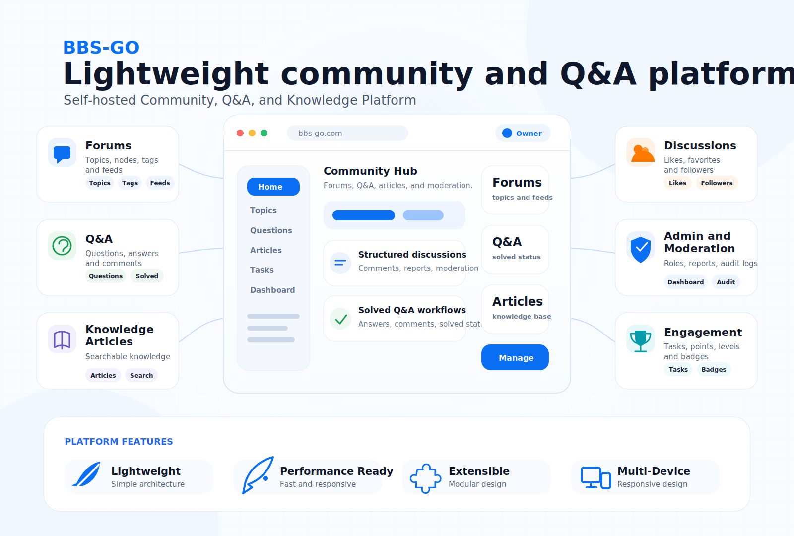

[English](README.md) | [中文](README.zh-CN.md)

# bbs-go

A lightweight community and Q&A platform for forums, knowledge bases, and discussions.

It combines discussions, Q&A workflows, articles, comments, notifications, moderation, roles, an admin dashboard, and optional engagement mechanics such as tasks, points, levels, and badges. Use it when chat is too noisy, static docs are not interactive enough, or heavyweight forum suites feel like too much for your team.

## Official Links

- Website: [https://bbs-go.com](https://bbs-go.com)
- Live demo: [https://bbs.bbs-go.com](https://bbs.bbs-go.com)
- GitHub: [https://github.com/mlogclub/bbs-go](https://github.com/mlogclub/bbs-go)
- GitHub Discussions: [https://github.com/mlogclub/bbs-go/discussions](https://github.com/mlogclub/bbs-go/discussions)
- Docker Hub: [https://hub.docker.com/r/mlogclub/bbs-go](https://hub.docker.com/r/mlogclub/bbs-go)

## Demo

- Community frontend: <https://bbs.bbs-go.com>
- Admin dashboard: <https://bbs.bbs-go.com/dashboard>
- Admin demo access: contact <g330721072@gmail.com>

## Quick Start with Docker Compose

bbs-go provides an official Docker image and Docker Compose deployment with built-in MySQL support.

```bash
curl -fsSL https://raw.githubusercontent.com/mlogclub/bbs-go/master/docker-compose.yml -o docker-compose.yml
docker compose up -d
```

Then open:

- Site: <http://localhost:3000>
- Admin dashboard: <http://localhost:3000/dashboard>
- Install wizard: <http://localhost:3000/install>

For production deployment options, environment variables, upgrades, and troubleshooting, see the Docker Hub page:

<https://hub.docker.com/r/mlogclub/bbs-go>

## Why Choose bbs-go

- **Community knowledge ready**: Give members one searchable place for discussions, questions, answers, articles, announcements, and reusable knowledge.
- **Deploy in minutes**: Use the official Docker image and Docker Compose setup for a simple self-hosted deployment.
- **Lightweight but complete**: Cover discussions, Q&A, articles, profiles, search, and admin workflows without a heavy enterprise stack.
- **Community engagement included**: Tasks, points, EXP, levels, rankings, and badges help communities create repeat engagement loops when needed.
- **Operations ready**: Manage users, content, reports, keyword filters, roles, site settings, and audit logs from the dashboard.
- **International by default**: Built-in `en-US` and `zh-CN` UI and server-message support.

## Typical Use Cases

- **Public and private forums**: structured community discussions for products, interests, teams, or vertical communities.
- **Q&A communities**: question-style topics, answers, comments, and solved/unsolved workflows.
- **Knowledge-sharing communities**: articles plus searchable discussions, tags, and organized reusable knowledge.
- **Product user communities**: support conversations, announcements, feedback, showcase posts, and user engagement.
- **Internal team spaces**: private discussions and role-based knowledge sharing for small teams.
- **Developer support hubs**: a searchable place for technical questions, guides, and best practices.

## Comparison with Other Platforms

This comparison is based on public product positioning and common use cases. The best choice depends on your team, stack, deployment model, and community goals.

| Platform | Best for | Strengths | When bbs-go may fit better |
| -------- | -------- | --------- | -------------------------- |
| Discord / Slack | Real-time chat communities | Fast conversations and broad adoption | You need searchable, long-lived discussions and accepted answers instead of knowledge disappearing in chat |
| GitHub Discussions | GitHub-centered project conversations | Close to code and contributors | You want an independent community space with articles, moderation, member profiles, and engagement tools outside GitHub |
| Discourse | Mature large communities and advanced governance workflows | Strong ecosystem, extensive moderation tools, hosted and self-hosted options | You want a lighter self-hosted platform, an all-in-one Go-based release, and built-in forum + Q&A + knowledge publishing workflows |
| Flarum / NodeBB | Modern forum communities | Polished forum UX and extension ecosystems | You need more built-in operations tools, Q&A flows, article-style publishing, and engagement mechanics without assembling many extensions |
| Question2Answer | Dedicated Q&A websites | Focused Q&A model, points and ranking features, simple PHP/MySQL deployment | You need Q&A plus broader forum discussions, articles, moderation, member operations, and long-term community engagement tools |

## Feature Map



## Core Features

### Member Experience

- Account registration and login with multiple login methods
- User profiles and personal homepages
- Follow and follower relationships
- In-app notifications and interaction reminders
- Point records and leaderboards

### Content and Engagement

- Publish and edit topics, feeds, and articles
- Comments, replies, likes, and favorites
- Tags and nodes for content organization and discovery
- Voting and hidden content
- Built-in search

### Growth Mechanics

- Daily check-in incentives
- Configurable task system for new-user, daily, and achievement rewards
- Points and EXP reward mechanisms
- Level progression configuration
- Badge and honor system

### Operations and Governance

- Unified management for users, topics, comments, and articles
- Report handling and keyword filters
- Role-based administration and permission-aware operations
- Site configuration and system settings
- Operation logs and audit trails

<!-- ## Screenshots


More English screenshots and short product GIFs are planned for the overseas launch materials. -->

## Roadmap

### Now

- Improve English docs, demo content, and GitHub onboarding
- Improve Docker-based evaluation flow
- Stabilize forum, Q&A, article, and dashboard workflows

### Next

- Better moderation and anti-spam tooling
- Import/export utilities
- Email notification improvements
- More OAuth providers

### Later

- Plugin or extension system exploration
- Managed hosting exploration
- Advanced search and analytics
- AI-assisted knowledge organization

## Internationalization

bbs-go includes English and Simplified Chinese language support:

- `en-US`
- `zh-CN`

The admin dashboard and server-side messages are designed for English and Simplified Chinese deployments.

## License and Commercial Use

bbs-go is open source under the [GPLv3 License](../LICENSE).

You may use, modify, and self-host bbs-go under the terms of GPLv3.

If you want to embed bbs-go into a proprietary product, redistribute a modified version under a different license, or need custom commercial terms, please contact us for a commercial license.

Commercial licensing, deployment support, customization, migration, and long-term maintenance are available by email: <g330721072@gmail.com>.

## Community and Contact

- Community questions: [GitHub Discussions](https://github.com/mlogclub/bbs-go/discussions)
- Bugs and feature requests: [GitHub Issues](https://github.com/mlogclub/bbs-go/issues)
- Commercial support: <g330721072@gmail.com>
- Security reports: email <g330721072@gmail.com> with `[Security]` in the subject

## Contributors

<a href="https://github.com/mlogclub/bbs-go/graphs/contributors"></a>
